# Kunoichi_Suzuran - Project Map

## Tech Stack
- **Game Engine:** Godot Engine v4.6 project settings / GL Compatibility
- **Programming Language:** GDScript
- **Rendering:** GL Compatibility Mode
- **Tooling:** Python (for asset generation scripts like `create_tilesheet.py`)
- **Architecture Patterns:**
  - Component-based architecture (e.g., `enemy_health_component.gd`, `knockback_component.gd`)
  - State Machine Pattern (e.g., Player and Enemy states)
  - Singleton / Autoload Manager Pattern (Global state, Audio, Events, UI Transitions)

## Directory Structure

```text
/
├── assets/           // Static resources: images, audio, fonts, shaders, etc.
│   ├── AlienTileSet/ // Alien tileset image resources
│   ├── audio/        // BGM and SE audio resources
│   ├── fonts/        // Font resources used by FontTheme
│   ├── images/       // Player, enemy, item, bullet, portrait, and tileset images
│   └── shaders/      // Runtime shader files referenced by scenes/scripts
├── data/             // Event configuration and dialogue resources (.tres)
├── scenes/           // Godot scene files (.tscn)
│   ├── backgrounds/  // Background scenes
│   ├── bullets/      // Projectile and bullet scenes
│   ├── dialogue/     // Dialogue system UI scenes
│   ├── effects/      // Reserved for effect scenes; currently empty
│   ├── enemies/      // Enemy character scenes
│   ├── items/        // Item scenes
│   ├── levels/       // Level maps and event area scenes
│   ├── player/       // Player character scenes
│   ├── traps/        // Trap object scenes
│   └── ui/           // Scene transitions and game UI
├── scripts/          // GDScripts for logic control
│   ├── autoload/     // Singleton managers
│   ├── backgrounds/  // Background control scripts
│   ├── bullets/      // Projectile/bullet control scripts
│   ├── components/   // Shared/reusable functional components
│   ├── dialogue/     // Dialogue/conversation system control logic
│   ├── effects/      // Effect control scripts
│   ├── enemies/      // Enemy behavior, components, and state machine logic
│   │   ├── components/
│   │   └── states/
│   ├── events/       // Event system control logic
│   ├── global/       // Global processing scripts (camera, enemy management)
│   ├── items/        // Item control scripts
│   ├── levels/       // Level progression and transition scripts
│   ├── player/       // Player behavior, components, states, buffs, and parameters
│   │   ├── buffs/
│   │   ├── components/
│   │   ├── effects/
│   │   └── states/
│   ├── settings/     // Game settings menu (UI/Save) logic
│   ├── traps/        // Trap object control scripts
│   └── ui/           // Various UI control scripts (gauges, indicators, etc.)
├── default_bus_layout.tres // Audio bus layout settings
├── project.godot           // Godot project configuration file
└── rules.md                // Project development rules and conventions
```
*(Note: `.git/`, `.godot/`, `.claude/`, macOS system files, and autogenerated temporary files are ignored per `.gitignore`)*

## Dependencies & Architecture Flow

```mermaid
graph TD
    subgraph Data [Resources / Assets]
        EventData[Event & Dialogue Data .tres]
        GameAssets[Assets: Images, Audio, Fonts]
    end

    subgraph Core Logic [Scripts]
        PlayerLogic[Player Logic & Components]
        EnemyLogic[Enemy AI / State Machine]
        EventLogic[Event & Dialogue Scripts]
        SystemLogic[Settings & System Logic]
    end

    subgraph Scenes [UI & Entities]
        LevelScenes[Levels & Maps]
        PlayerScene[Player Entity]
        EnemyScenes[Enemy Entities]
        UIScenes[UI & Menus]
    end

    subgraph AutoLoads [Autoloads / Managers]
        WindowFocusManager
        GameSettings
        FPSDisplay
        PauseManager
        EventManager
        AudioManager
        TransitionManager
        DebugManager
        SignalDebugger
        ProjectilePoolManager
        MenuManager
        SaveLoadManager
        FontTheme
    end

    subgraph RuntimeResources [Runtime Resources]
        ShaderAssets[assets/shaders/*.gdshader]
        FontAssets[assets/fonts/*.ttf]
        AudioAssets[assets/audio/**/*.mp3]
        ProjectileScene[Projectile Scene]
    end

    %% Scene Hierarchy / Instantiation
    LevelScenes --> PlayerScene
    LevelScenes --> EnemyScenes
    LevelScenes --> UIScenes

    %% Logic Binding
    PlayerScene -.-> PlayerLogic
    EnemyScenes -.-> EnemyLogic
    UIScenes -.-> EventLogic
    UIScenes -.-> SystemLogic

    %% Resource Usage
    LevelScenes --> GameAssets
    UIScenes --> GameAssets
    EventLogic --> EventData
    SystemLogic --> AudioAssets
    SystemLogic --> FontAssets
    TransitionManager --> ShaderAssets

    %% Manager Interactions
    PlayerLogic ==> AutoLoads
    EnemyLogic ==> AutoLoads
    EventLogic ==> AutoLoads
    SystemLogic ==> AutoLoads
    ProjectilePoolManager --> ProjectileScene
```



### Key Module Roles & Dependencies
1. **Autoloads (Managers):** 
   Configured in `project.godot`. Most autoload scripts live in `scripts/autoload/`; `TransitionManager` is registered as `scenes/ui/transition_manager.tscn`, which uses `scripts/autoload/transition_manager.gd`. Current autoloads are `WindowFocusManager`, `GameSettings`, `AudioManager`, `FPSDisplay`, `PauseManager`, `TransitionManager`, `DebugManager`, `SignalDebugger`, `ProjectilePoolManager`, `MenuManager`, `SaveLoadManager`, `EventManager`, and `FontTheme`. Changes here have the largest blast radius.
2. **Entity Logic (Player & Enemy):**
   Located in `scripts/player/` and `scripts/enemies/`. Both entities use state-oriented logic: player states inherit from `player_base_state.gd`, and enemy AI states inherit from `enemy_base_state.gd`. Entity-specific components live under `scripts/player/components/` and `scripts/enemies/components/`.
3. **Components & Effects (Reusable Functions):**
   Shared components live in `scripts/components/` (currently including shared knockback logic). Entity-specific components live under the player/enemy component directories, while effects live in `scripts/effects/` and `scripts/player/effects/`. These add functionality through composition or helper objects rather than broad inheritance.
4. **Level & Map Progress (Progression Management):**
   Located in `scenes/levels/` and `scripts/levels/`. Collision with `transition_area.tscn` triggers scene changes through `TransitionManager`; collision with `event_area.tscn` loads `data/event_config.tres` and dispatches events through `EventManager`.
5. **Dialogue & Event System (Conversation & Event Control):**
   Located in `scripts/dialogue/` and `scripts/events/`. These load resources like `data/dialogues/*.tres` and reflect them in UI scenes (e.g., `dialogue_box.tscn`). Event progression is dispatched via `EventManager`.
6. **Projectile Flow:**
   `ProjectilePoolManager` preloads `scenes/bullets/projectile.tscn`. `scripts/bullets/projectile.gd` uses projectile textures from `assets/images/bullets/` and returns projectiles to the pool when they are destroyed.
7. **Audio, Fonts, and Shaders:**
   `AudioManager` preloads SE resources from `assets/audio/se/`, level scenes reference BGM such as `assets/audio/bgm/forest.mp3`, `FontTheme` preloads `assets/fonts/NotoSansJP-Regular.ttf`, and transition/player visual effects use shader sources under `assets/shaders/`.
