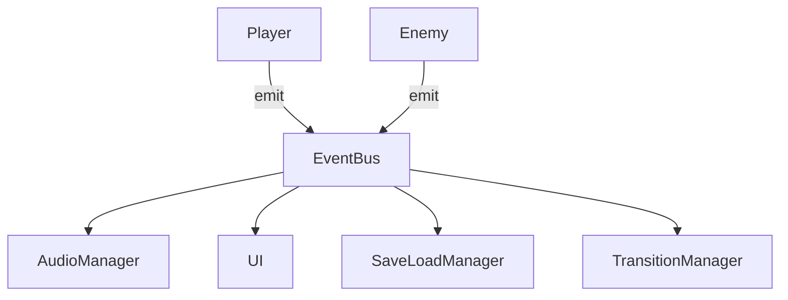
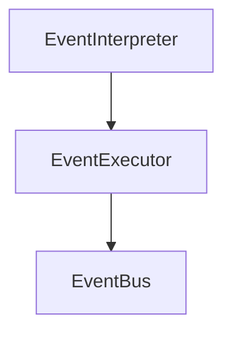

# Signal駆動アーキテクチャへのリファクタリング提案（更新版）

## 目的

現状の構造は Autoload（Manager群）への直接依存が強く、`rules.md` に記載されている「Signalによる疎結合設計」と乖離している。

本リファクタの目的：

* ノード間の直接依存を排除
* Signalベースのイベント駆動へ移行
* スケーラビリティと保守性の向上

---

## 現状の問題

### 1. 直接依存（Tight Coupling）

```gdscript
AudioManager.play_se("hit")
TransitionManager.change_scene("res://...")
```

* 呼び出し元が実装に依存
* テスト困難
* 差し替え不能

---

### 2. Autoloadの肥大化

* Managerがロジックハブ化
* 責務集中
* 依存の追跡が困難

---

## 方針

### Autoloadを削除しない

### EventBus（Signalハブ）へ再編成する

---

## 新アーキテクチャ



---

## EventBus導入

### 新規ファイル

`scripts/autoload/EventBus.gd`

```gdscript
extends Node

# --- Domain Events ---
signal player_damaged(amount: int)
signal enemy_killed(enemy: Node)

# --- Request Events ---
signal request_play_se(name: String)
signal request_transition(scene_path: String)

# --- Lifecycle ---
signal scene_loaded()
```

Autoloadに登録：

```
EventBus -> scripts/autoload/EventBus.gd
```

---

## 差分例（実コードレベル）

### 1. Player.gd

#### Before

```gdscript
func take_damage(amount: int) -> void:
    hp -= amount
    AudioManager.play_se("hit")
```

#### After

```gdscript
func take_damage(amount: int) -> void:
    hp -= amount
    EventBus.player_damaged.emit(amount)
    EventBus.request_play_se.emit("hit")
```

---

### 2. Enemy.gd

#### Before

```gdscript
func die() -> void:
    queue_free()
    EventManager.enemy_killed(self)
```

#### After

```gdscript
func die() -> void:
    queue_free()
    EventBus.enemy_killed.emit(self)
```

---

### 3. AudioManager.gd

#### After（Bridge対応）

```gdscript
func _ready() -> void:
    EventBus.request_play_se.connect(_on_request_play_se)

func _on_request_play_se(name: String) -> void:
    play_se(name)

func play_se(name: String) -> void:
    # 再生処理
```

---

### 4. TransitionManager.gd

```gdscript
func _ready() -> void:
    EventBus.request_transition.connect(_on_request_transition)

func _on_request_transition(path: String) -> void:
    get_tree().change_scene_to_file(path)
```

---

### 5. UI（例：HUD.gd）

```gdscript
func _ready() -> void:
    EventBus.player_damaged.connect(_on_player_damaged)

func _on_player_damaged(amount: int) -> void:
    update_hp_display()
```

---

## EventManagerの分解（詳細化）

### 現状の問題

* イベント進行・解釈・実行・UI操作が単一クラスに集中
* 責務境界が不明確
* 将来的な再肥大化リスク

---

### 分割方針（明確化）

| モジュール            | 役割                     |
| ---------------- | ---------------------- |
| EventInterpreter | .tres / データの解析（純粋関数寄り） |
| EventExecutor    | ゲーム内処理の実行（副作用あり）       |
| EventBus         | 状態変化・リクエストの通知          |

---

### 追加で定義すべき内容（必須）

以下を実装前に整理すること：

```
- 現EventManagerの責務一覧
- 処理フロー（シーケンス）
- 状態管理の所在（State Machineの有無）
- 非同期処理（await / yield）の扱い
```

---

### 分解イメージ



---

## Signal設計ルール

### 命名規則

```gdscript
signal player_damaged(amount: int)
signal request_play_se(name: String)
```

* 状態変化 → 過去形
* リクエスト → `request_`

---

### 禁止事項

```gdscript
AudioManager.play_se()   # BAD
TransitionManager.go()   # BAD
```

---

### 推奨

```gdscript
EventBus.request_play_se.emit()  # GOOD
```

---

## 移行手順（統合版）

```
0. 現状のEventManager.gdと主要ノードの責務・依存関係を整理
1. EventBus追加（Signal Logger付き）
2. Bridgeパターン導入（既存Managerは残す）
3. AudioManagerをSignal化
4. TransitionManagerをSignal化
5. Player / Enemyの直接呼び出し削除（Signal emitへ置換）
6. UIコンポーネントをSignal接続
7. EventManager分解（Interpreter / Executor）
8. 直接呼び出しの完全削除・最終整理
```

---

## デバッグ支援（必須）

```gdscript
func _ready():
    self.connect("*", _on_any_signal)

func _on_any_signal(...):
    print("Event fired:", ...)
```

---

## 効果

| 項目   | 改善内容 |
| ---- | ---- |
| 結合度  | 低下   |
| テスト性 | 向上   |
| 拡張性  | 向上   |
| デバッグ | 容易   |

---

## リスクと補足（重要）

### Signalの同期実行

GodotのSignalは基本的に**同期実行**であるため：

* 実行順序依存のバグ
* 副作用の連鎖

が発生する可能性がある。

---

### 対策

必要に応じて：

```gdscript
call_deferred()
await get_tree().process_frame
```

を使用し、実行タイミングを制御する。

---

## 結論

* 安全な移行（段階的 + Bridge）を最優先
* EventManagerの分解は設計を明確化してから実施
* Signal駆動へ移行することで長期的な保守性を確保

現段階で実施する価値は高い。
次は「EventManagerの現状分解（実コードベース）」をやるのが適切です。